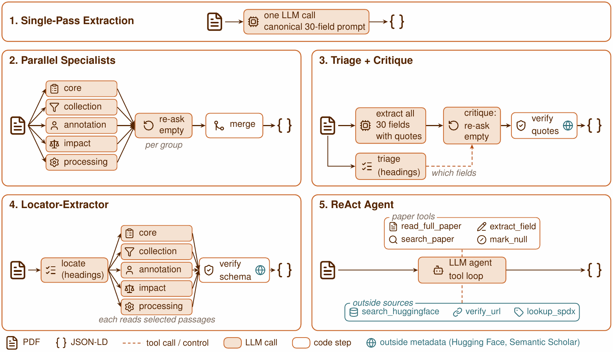
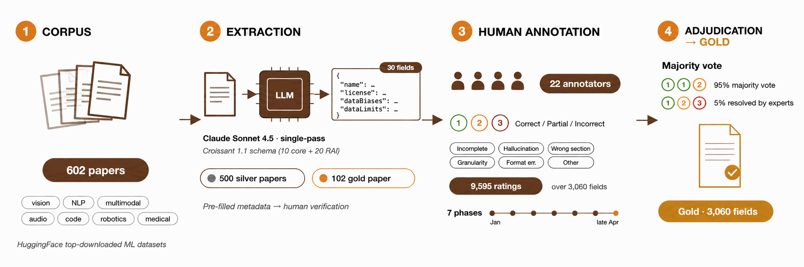

<p align="center"></p>

<h1 align="center">CroissantMiner</h1>

<p align="center">
Extract <a href="https://github.com/mlcommons/croissant">Croissant</a> metadata, including the 20 Responsible AI fields,
from the paper that introduces an ML dataset.
</p>

<p align="center">
<a href="https://huggingface.co/spaces/bearda/croissantminer"></a>
<a href="https://huggingface.co/datasets/bearda/croissantminer"></a>
<a href="https://github.com/berkearda/croissantminer/actions/workflows/tests.yml"></a>

<a href="LICENSE"></a>
</p>

Code, benchmark and systems of **CroissantMiner: Automated Extraction and Validation of Croissant Metadata for ML
Datasets** (NeurIPS 2026, Evaluations and Datasets Track). Paper: arXiv link follows.

Documenting a dataset in the [Croissant](https://github.com/mlcommons/croissant) format, including its Responsible
AI (RAI) fields, takes time, and venues such as the NeurIPS Evaluations and Datasets Track ask for it.
CroissantMiner reads the paper that introduces a dataset and drafts all 30 fields of the Croissant 1.1 schema: 10
core fields (name, license, creators and others) and 20 RAI fields (how the data was collected and annotated,
known biases, limitations, intended uses and others). You check the draft and publish it.

- **For dataset authors:** one command turns a paper into a Croissant file that passes the MLCommons validator.
- **For researchers:** a benchmark of 602 dataset papers with human gold annotations for 102 of them, the outputs
  and scores of 24 extraction systems, and the code to evaluate new ones.

## Try it in your browser

The [demo](https://huggingface.co/spaces/bearda/croissantminer) runs the six systems below on a PDF you upload.
It needs your own Anthropic or OpenAI API key, which is sent only to that provider and not stored.

## Quick start

Python 3.10 to 3.13.

```bash
git clone https://github.com/berkearda/croissantminer
cd croissantminer
pip install -e ".[validate]"     # the extraction tool and the Croissant validator
export ANTHROPIC_API_KEY=...      # or put it in a .env file in the folder you run from
croissantminer extract paper.pdf
```

```text
Extracting with Single-pass · Claude Sonnet 4.6 (usually about 30 s)...
Found 22 of 30 fields (core 9 of 10, Responsible AI 13 of 20) with single-pass in 35 s, about $0.06.
Not found: license, rai:dataCollectionMissingData, rai:dataCollectionTimeframe, ...
Wrote:  paper.croissant.json (Croissant 1.1)
Check:  passes the mlcroissant validator (2 recommended properties missing)
These are drafts by a language model: check each value against the paper before publishing.
```

| Option | What it does |
|---|---|
| `-o my_dataset.json` | choose the output file |
| `--method react` | use another system (list them with `croissantminer methods`) |
| `--hf-id org/name` | give the dataset's Hugging Face id, so the agentic systems can check its license and URL |
| `--card README.md` | read the dataset card together with the paper |
| `--fields values.json` | also save the extracted values with their supporting quotes |

`croissantminer validate my_dataset.json` checks any Croissant file with the MLCommons validator.

From Python:

```python
from croissantminer import extract

result = extract("paper.pdf")            # method="single-pass" by default
print(result.summary())                  # Found 22 of 30 fields (core 9 of 10, Responsible AI 13 of 20)
result.fields["rai:dataCollection"]      # one extracted value
result.croissant                         # the Croissant 1.1 file as a dict
```

The tool runs the systems' code in this repository, so install it from a clone as above. A package on PyPI will
follow.

## Which method to choose

<p align="center"></p>
<p align="center"><sub>The five system designs, from the paper. Single-pass reads the whole paper in one model call; the four
agentic systems split the work into steps.</sub></p>

All six methods are systems from the paper, with the same code and settings. Score: the composite over the 30
fields on the 88 test papers (see [Results](#results)). Time and cost: one run on the 22-page GSM8K paper.

| Method | Model | Score | Time | Cost | API key |
|---|---|---|---|---|---|
| `single-pass` (default) | Claude Sonnet 4.6 | **0.709** | 35 s | $0.06 | `ANTHROPIC_API_KEY` |
| `single-pass-gpt` | GPT-5.4 | 0.665 | about 30 s | not measured | `OPENAI_API_KEY` |
| `react` | Claude Sonnet 4.6 | 0.652 | 80 s | $0.17 | `ANTHROPIC_API_KEY` |
| `parallel-specialists` | Claude Sonnet 4.6 | 0.647 | 15 s | $0.42 | `ANTHROPIC_API_KEY` |
| `triage-critique` | Claude Sonnet 4.6 | 0.624 | 35 s | $0.08 | `ANTHROPIC_API_KEY` |
| `locator-extractor` | Claude Sonnet 4.6 | 0.566 | 40 s | $0.09 | `ANTHROPIC_API_KEY` |

Start with `single-pass`: it is the most accurate and among the cheapest. `triage-critique` and
`locator-extractor` return a supporting quote for most values (`--fields`), which makes checking faster, and
`react` gives a reason for each field it leaves empty.

## Before you publish the file

- **Check every value against the paper.** The fields are drafts. Typical mistakes are a value the paper does
  not state, a detail from a related dataset, or, for an anonymous submission, the page header taken as the
  publisher.
- **Empty fields are left out** of the Croissant file, never filled with placeholders. Add what you know.
- **The validator checks the format, not the content.** A file that passes can still contain wrong values.
- **Your paper is sent to the model provider** (Anthropic or OpenAI) under your API key and their terms.
- **API keys** are read from the environment or a `.env` file, never from the command line, so they do not end
  up in your shell history.

## The benchmark

<p align="center"></p>
<p align="center"><sub>How the benchmark was built, from the paper: 602 dataset papers, drafts of all 30 fields by Claude Sonnet 4.5,
9,595 ratings by 22 annotators, and a majority vote or an expert decision for each of the 3,060 gold cells.</sub></p>

- **Papers:** 602 dataset papers. 102 have human-validated gold annotations (3,060 cells, 22 annotators) and 500
  have LLM-generated silver annotations. The 102 gold papers are split into 14 development and 88 test papers.
- **Systems:** single-pass extraction and four agentic architectures (ReAct, Parallel Specialists,
  Triage + Critique, Locator-Extractor), each with several LLM backbones.
- **Evaluation:** rule-based scoring for the 10 core fields, an LLM judge (GLM-5) for the 20 RAI fields, and tests
  that check the scorer against the numbers in the paper.
- **Data:** the annotations, system outputs and judge verdicts are on
  [Hugging Face](https://huggingface.co/datasets/bearda/croissantminer) and in `data/` (see `data/README.md`).

### Results

Test split (88 papers). *Core* averages the 10 core fields, *RAI* the 20 RAI fields, and *Composite* weights all
30 fields equally; 95% confidence intervals come from 2,000 bootstrap samples over papers. The gold annotations
were first drafted by Claude Sonnet 4.5 and then checked and corrected by annotators, so Anthropic-family
systems are marked with \*. Claude Sonnet 4.5 itself is shown for reference and not ranked.

| System | Architecture | Core | RAI | Composite [95% CI] |
|---|---|---|---|---|
| Claude Sonnet 4.6\* | Single-pass | 0.752 | 0.687 | **0.709** [0.688, 0.729] |
| Claude Opus 4.7\* | Single-pass | 0.676 | 0.711 | 0.699 [0.665, 0.732] |
| GPT-5.4 | Single-pass | 0.653 | 0.671 | 0.665 [0.648, 0.692] |
| Qwen 3.6 35B-A3B | Single-pass | 0.698 | 0.601 | 0.634 [0.615, 0.654] |
| GLM-5.1 | Single-pass | 0.675 | 0.599 | 0.625 [0.604, 0.645] |
| Gemini 2.5 Flash | Single-pass | 0.615 | 0.616 | 0.616 [0.592, 0.639] |
| GPT-5.4 Mini | Single-pass | 0.561 | 0.614 | 0.596 [0.573, 0.620] |
| Gemini 3.1 Pro Preview | Single-pass | 0.577 | 0.596 | 0.590 [0.571, 0.609] |
| DeepSeek V3.2 | Single-pass | 0.617 | 0.555 | 0.575 [0.547, 0.604] |
| Mistral Small 4 | Single-pass | 0.616 | 0.482 | 0.527 [0.510, 0.544] |
| Llama 4 Scout 17B | Single-pass | 0.506 | 0.334 | 0.391 [0.374, 0.409] |
| ReAct (Sonnet 4.6)\* | ReAct | 0.734 | 0.610 | 0.652 [0.626, 0.687] |
| ReAct (GPT-5.4) | ReAct | 0.688 | 0.603 | 0.631 [0.601, 0.663] |
| ReAct (Gemini 3.1 Pro) | ReAct | 0.723 | 0.511 | 0.582 [0.556, 0.605] |
| Parallel Specialists (Sonnet 4.6)\* | Parallel Specialists | 0.699 | 0.621 | 0.647 [0.626, 0.667] |
| Parallel Specialists (GPT-5.4) | Parallel Specialists | 0.627 | 0.570 | 0.589 [0.572, 0.611] |
| Parallel Specialists (Gemini 3.1 Pro) | Parallel Specialists | 0.607 | 0.505 | 0.539 [0.518, 0.559] |
| Triage + Critique (Sonnet 4.6)\* | Triage + Critique | 0.675 | 0.599 | 0.624 [0.606, 0.653] |
| Triage + Critique (GPT-5.4) | Triage + Critique | 0.592 | 0.540 | 0.557 [0.537, 0.585] |
| Triage + Critique (Gemini 3.1 Pro) | Triage + Critique | 0.513 | 0.397 | 0.436 [0.415, 0.457] |
| Locator-Extractor (Sonnet 4.6)\* | Locator-Extractor | 0.643 | 0.528 | 0.566 [0.543, 0.592] |
| Locator-Extractor (GPT-5.4) | Locator-Extractor | 0.523 | 0.492 | 0.502 [0.481, 0.528] |
| Locator-Extractor (Gemini 3.1 Pro + GPT-5.4 Mini) | Locator-Extractor | 0.560 | 0.436 | 0.478 [0.456, 0.502] |
| Locator-Extractor (Gemini 3.1 Pro) | Locator-Extractor | 0.500 | 0.422 | 0.448 [0.423, 0.471] |
| *Claude Sonnet 4.5\* (reference)* | *Single-pass* | *0.903* | *0.840* | *0.861 [0.830, 0.893]* |

## Reproducing the paper

### Installation

The paper's environment uses Python 3.10 or 3.11 and the pinned versions in `requirements.txt`:

```bash
git clone https://github.com/berkearda/croissantminer
cd croissantminer
pip install -r requirements.txt
pip install -e .
```

API keys are only needed to run the systems or the judge. Copy `.env.example` to `.env` and fill in the keys for
the providers you use.

### Checking the numbers

No API keys and no cost: the scores are recomputed from the stored system outputs
(`data/extractions/`), judge verdicts (`data/judged/`) and gold annotations
(`data/annotations/gold.parquet`), which are included in this repository.

1. Check Table 2 and the per-field tables in the appendix against the published numbers:
   ```bash
   make reproduce
   ```
2. Print Table 2 (Core, RAI and Composite with 95% confidence intervals, grouped as in the paper):
   ```bash
   make table2
   ```
3. Run the pairwise significance tests (paired bootstrap, Wilcoxon and McNemar with BH-FDR correction):
   ```bash
   make significance
   ```

### Running the systems on the benchmark

The benchmark PDFs are not redistributed. Download them from their public sources into `data/raw/` with
`python scripts/download_papers.py`. The commands below use the Claude Sonnet 4.6 backbone; the backbone names
are listed in `scripts/_agentic_helpers.py` (`MODELS`).

| System | Code | Command |
|---|---|---|
| Single-pass | `scripts/experiments/model_comparison/extract_all_models.py` | `python scripts/experiments/model_comparison/extract_all_models.py --model claude-sonnet-4-6` |
| ReAct | `croissantminer/react_agent/` | `python scripts/run_react_agent.py --split test --backbone sonnet-4-6 --prompt-variant v3` |
| Parallel Specialists | `scripts/multi_agents/` | `python scripts/multi_agents/run.py --config premium --prompt-variant v4 --test-only` |
| Triage + Critique | `scripts/agentic_v2.py` | `python scripts/agentic_v2.py --backbone sonnet-4-6 --prompt-variant v4` |
| Locator-Extractor | `scripts/agentic_lev.py` | `python scripts/agentic_lev.py --locator-backbone sonnet-4-6 --extractor-backbone sonnet-4-6 --prompt-variant v3` |

Notes on re-running:

- **Outputs** go to `data/extractions/<system>/`. The released outputs are already there, and the scripts skip
  papers that have an output, so work in a copy of the repository (or move the folder away) to re-run a system.
  The reproduction test reads these folders.
- **Single-pass rows of Table 2** were produced with the batch version of the script above,
  `scripts/experiments/model_comparison/extract_all_models_batch.py` (Claude, GPT-5.4 and Gemini models), with
  `scripts/euler/extract_api_models.py` (DeepSeek V3.2 and GLM-5.1) and with `scripts/euler/extract_openmodels.py`
  on vLLM (Llama 4 Scout, Qwen 3.6 and Mistral Small 4).
- **Triage + Critique** reads the stored Gemini 2.5 Flash triage in `data/agentic/phase1/` (included).
  **Locator-Extractor** also needs a section index of each paper, which contains the paper text and is not
  redistributed: build it with `python scripts/agentic_phase0.py` after downloading the PDFs. Its GPT-5.4 and
  Gemini 3.1 Pro rows use `--backbone <model>`, which takes the stored triage as the locator.
- **Prompts:** single-pass extraction uses the prompt in `croissantminer/config.py` at temperature 0 (Claude
  Opus 4.7 does not accept a temperature setting) and gives the model the full paper text; the ranked
  single-pass outputs record the prompt's hash (`1e1cfdd99246bbf5`) in their `_meta` block. The agentic systems
  keep their own prompts next to their code.
- **Names in the code:** Triage + Critique is `agentic_v2`, Locator-Extractor `agentic_lev` (or LEV), and
  Parallel Specialists `specialist`.

### How scoring works

- **Core fields (rule-based):** 7 fields are scored as match or no match after normalization: license,
  language, live dataset and URL must be equal after normalization; the date must have the same year; the name
  matches if one contains the other or their words overlap as subsets; the publisher matches if at least half
  of the words of the shorter one are shared. Creator, citation and description are scored with token F1.
  See `evaluation/field_metrics.py`.
- **RAI fields (LLM judge):** GLM-5 compares each answer with the gold value on a 3-point scale: correct (1),
  partially correct (0.5), wrong (0). Prompt and calls: `scripts/judge_rerun_test88.py`.
- **Empty values:** when the paper does not report a field, the gold value is `[NULL - not found in paper]`.
  If the system also leaves the field empty, the cell is not scored; if it fills it in, the cell scores 0.
  A field the paper reports but the system leaves empty also scores 0. An answer counts as empty only when it
  is missing, `null` or blank; a text answer such as "null" or "N/A" is scored like any other answer.
- **Composite:** the mean of each field over the test papers, then the mean over the 30 fields.

`scripts/figures/build_test88_headline_table.py` applies these rules (it is the exact file behind the paper's
numbers, so its internal comments are left as they were); `tests/test_scoring_rules.py` shows each rule on a
small example. `data/README.md` describes the data files.

### Tests

```bash
make test
```

About 120 tests, about 10 seconds, no API keys. They cover the scoring rules, the handling of model output, the
command line and the Croissant output, and the check that Table 2 and Tables 5 and 6 are reproduced exactly.
GitHub Actions runs them on every push, and the tool's tests on Python 3.10 to 3.13.

## Extending CroissantMiner

- **A new method or model for the tool:** methods are registered in `croissantminer/methods.py` (`METHODS` and
  `run`), model backbones in `scripts/_agentic_helpers.py` (`MODELS`), and the Croissant file is built in
  `croissantminer/croissant.py`.
- **A new system on the benchmark:** see [CONTRIBUTING.md](CONTRIBUTING.md) for the output format and the scoring.
- **A wrong extraction, a bug or an idea:** open an [issue](https://github.com/berkearda/croissantminer/issues/new/choose)
  or a [discussion](https://github.com/berkearda/croissantminer/discussions).

## Repository layout

| Path | Contents |
|---|---|
| `croissantminer/` | Package: command line and Python API (`cli.py`, `api.py`), the six systems (`methods.py`), the Croissant file (`croissant.py`), the extraction prompt, PDF reading and the ReAct agent |
| `scripts/` | The other systems, the judge, tables and figures (guide in `scripts/README.md`) |
| `evaluation/` | Field metrics and system registry used by the scorer |
| `data/` | Gold annotations, judge verdicts and system outputs |
| `silver/` | Selection and extraction of the 500 silver papers |
| `tests/` | Tests and the published numbers they check against |
| `hf_space/` | The Hugging Face Space demo |
| `legacy/` | Early prototype and experiments from before the paper, kept for reference and not maintained |

The scripts that read the named annotation sheets are not included, to protect the annotators'
privacy; `data/annotations/gold.parquet` and `data/annotations/iaa.parquet` are their output.
Comments that cite `decisions.md` or task numbers (`T-###`) refer to our
internal project log, which is not included.

## Community

Questions and ideas go to [Discussions](https://github.com/berkearda/croissantminer/discussions), bugs and wrong
extractions to [issues](https://github.com/berkearda/croissantminer/issues). Please read
[CONTRIBUTING.md](CONTRIBUTING.md) before opening a pull request. Everyone taking part follows the
[code of conduct](CODE_OF_CONDUCT.md); security problems are reported as described in [SECURITY.md](SECURITY.md).
Changes are listed in [CHANGELOG.md](CHANGELOG.md).

## Citation

```bibtex
@inproceedings{arda2026croissantminer,
  title     = {CroissantMiner: Automated Extraction and Validation of Croissant Metadata for ML Datasets},
  author    = {Arda, Berke and Yavuz, Ahmetcan and Gerry, Paul and Lobentanzer, Sebastian and
               Sarwar, Nobin and Giner-Miguelez, Joan and Chen, Kongtao and Zhang, Luyao and
               Sachan, Mrinmaya and Akhtar, Mubashara},
  booktitle = {Advances in Neural Information Processing Systems (Evaluations and Datasets Track)},
  year      = {2026}
}
```

## License

Code: MIT (see `LICENSE`). Annotations: CC BY 4.0 (see the dataset card). The papers remain under their
authors' licenses.
